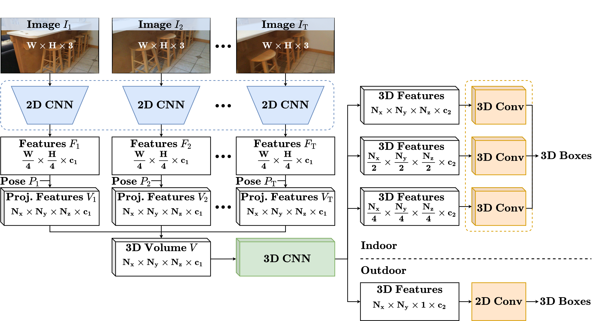
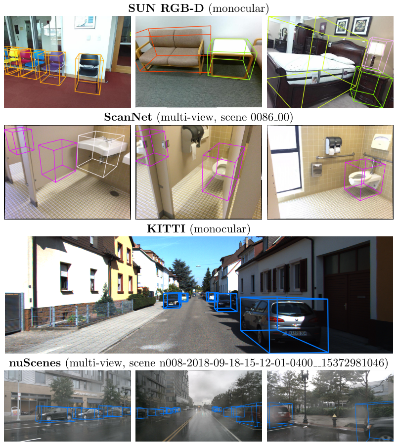

[](https://paperswithcode.com/sota/monocular-3d-object-detection-on-sun-rgb-d?p=imvoxelnet-image-to-voxels-projection-for)
[](https://paperswithcode.com/sota/room-layout-estimation-on-sun-rgb-d?p=imvoxelnet-image-to-voxels-projection-for)

# ImVoxelNet: Image to Voxels Projection for Monocular and Multi-View General-Purpose 3D Object Detection

**News**:
 * :fire: August, 2022. `ImVoxelNet` for `SUN RGB-D` is [now](https://github.com/open-mmlab/mmdetection3d/pull/1738) [supported](https://github.com/open-mmlab/mmdetection3d/tree/master/configs/imvoxelnet) in [mmdetection3d](https://github.com/open-mmlab/mmdetection3d).
 * :fire: October, 2021. Our paper is accepted at [WACV 2022](https://wacv2022.thecvf.com). We simplify 3d neck to make indoor models much faster and accurate. For example, this improves `ScanNet` `mAP` by more than 2%. Please find updated configs in [configs/imvoxelnet/*_fast.py](https://github.com/saic-vul/imvoxelnet/tree/master/configs/imvoxelnet) and [models](https://github.com/saic-vul/imvoxelnet/releases/tag/v1.2).
 * :fire: August, 2021. We adapt center sampling for indoor detection. For example, this improves `ScanNet` `mAP` by more than 5%. Please find updated configs in [configs/imvoxelnet/*_top27.py](https://github.com/saic-vul/imvoxelnet/tree/master/configs/imvoxelnet) and [models](https://github.com/saic-vul/imvoxelnet/releases/tag/v1.1).
 * :fire: July, 2021. We update `ScanNet` image preprocessing both [here](https://github.com/saic-vul/imvoxelnet/pull/21) and in [mmdetection3d](https://github.com/open-mmlab/mmdetection3d/pull/696).
 * :fire: June, 2021. `ImVoxelNet` for `KITTI` is now [supported](https://github.com/open-mmlab/mmdetection3d/tree/master/configs/imvoxelnet) in [mmdetection3d](https://github.com/open-mmlab/mmdetection3d).

This repository contains implementation of the monocular/multi-view 3D object detector ImVoxelNet, introduced in our paper:

> **ImVoxelNet: Image to Voxels Projection for Monocular and Multi-View General-Purpose 3D Object Detection**<br>
> [Danila Rukhovich](https://github.com/filaPro),
> [Anna Vorontsova](https://github.com/highrut),
> [Anton Konushin](https://scholar.google.com/citations?user=ZT_k-wMAAAAJ)
> <br>
> Samsung Research<br>
> https://arxiv.org/abs/2106.01178

<p align="center"></p>

### Installation
For convenience, we provide a [Dockerfile](docker/Dockerfile). Alternatively, you can install all required packages manually.

This implementation is based on [mmdetection3d](https://github.com/open-mmlab/mmdetection3d) framework.
Please refer to the original installation guide [install.md](docs/install.md), replacing `open-mmlab/mmdetection3d` with `saic-vul/imvoxelnet`.
Also, [rotated_iou](https://github.com/lilanxiao/Rotated_IoU) should be installed with [these](https://github.com/saic-vul/imvoxelnet/blob/master/docker/Dockerfile#L31-L34) 4 commands.

Most of the `ImVoxelNet`-related code locates in the following files: 
[detectors/imvoxelnet.py](mmdet3d/models/detectors/imvoxelnet.py),
[necks/imvoxelnet.py](mmdet3d/models/necks/imvoxelnet.py),
[dense_heads/imvoxel_head.py](mmdet3d/models/dense_heads/imvoxel_head.py),
[pipelines/multi_view.py](mmdet3d/datasets/pipelines/multi_view.py).

### Datasets

We support three benchmarks based on the **SUN RGB-D** dataset.
 * For the [VoteNet](https://github.com/facebookresearch/votenet) benchmark with 10 object categories, 
   you should follow the instructions in [sunrgbd](data/sunrgbd). 
 * For the [PerspectiveNet](https://papers.nips.cc/paper/2019/hash/b87517992f7dce71b674976b280257d2-Abstract.html)
   benchmark with 30 object categories, the same instructions can be applied; 
   you only need to set `dataset` argument to `sunrgbd_monocular` when running `create_data.py`.
 * The [Total3DUnderstanding](https://github.com/yinyunie/Total3DUnderstanding)
   benchmark implies detecting objects of 37 categories along with camera pose and room layout estimation.
   Download the preprocessed data as 
   [train.json](https://github.com/saic-vul/imvoxelnet/releases/download/v1.0/sunrgbd_total_infos_train.json) and 
   [val.json](https://github.com/saic-vul/imvoxelnet/releases/download/v1.0/sunrgbd_total_infos_val.json) 
   and put it to `./data/sunrgbd`. Then run:
   ```shell
   python tools/data_converter/sunrgbd_total.py
   ```

For **ScanNet** please follow instructions in [scannet](data/scannet).
For **KITTI** and **nuScenes**, please follow instructions in [getting_started.md](docs/getting_started.md).

### Getting Started

Please see [getting_started.md](docs/getting_started.md) for basic usage examples.

**Training**

To start training, run [dist_train](tools/dist_train.sh) with `ImVoxelNet` [configs](configs/imvoxelnet):
```shell
bash tools/dist_train.sh configs/imvoxelnet/imvoxelnet_kitti.py 8
```

**Testing**

Test pre-trained model using [dist_test](tools/dist_test.sh) with `ImVoxelNet` [configs](configs/imvoxelnet):
```shell
bash tools/dist_test.sh configs/imvoxelnet/imvoxelnet_kitti.py \
    work_dirs/imvoxelnet_kitti/latest.pth 8 --eval mAP
```

**Visualization**

Visualizations can be created with [test](tools/test.py) script. 
For better visualizations, you may set `score_thr` in configs to `0.15` or more:
```shell
python tools/test.py configs/imvoxelnet/imvoxelnet_kitti.py \
    work_dirs/imvoxelnet_kitti/latest.pth --show \
    --show-dir work_dirs/imvoxelnet_kitti
```

### Models

`v2` adds center sampling for indoor scenario. `v3` simplifies 3d neck for indoor scenario. Differences are discussed in [v2](https://arxiv.org/abs/2106.01178v2) and [v3](https://arxiv.org/abs/2106.01178v3) preprints.

| Dataset   | Object Classes | Version | Download |
|:---------:|:--------------:|:-------:|:--------:|
| SUN RGB-D | 37 from <br> Total3dUnderstanding | v1 &#124; mAP@0.15: 41.5 <br> v2 &#124; mAP@0.15: 42.7 <br> v3 &#124; mAP@0.15: 43.7 | [model](https://github.com/saic-vul/imvoxelnet/releases/download/v1.0/20210525_091810.pth) &#124; [log](https://github.com/saic-vul/imvoxelnet/releases/download/v1.0/20210525_091810_atlas_total_sunrgbd.log) &#124; [config](configs/imvoxelnet/imvoxelnet_total_sunrgbd.py) <br> [model](https://github.com/saic-vul/imvoxelnet/releases/download/v1.1/20210808_005013.pth) &#124; [log](https://github.com/saic-vul/imvoxelnet/releases/download/v1.1/20210808_005013_imvoxelnet_total_sunrgbd_top27.log) &#124; [config](configs/imvoxelnet/imvoxelnet_total_sunrgbd_top27.py) <br> [model](https://github.com/saic-vul/imvoxelnet/releases/download/v1.2/20211007_105247.pth) &#124; [log](https://github.com/saic-vul/imvoxelnet/releases/download/v1.2/20211007_105247_imvoxelnet_total_sunrgbd_fast.log) &#124; [config](configs/imvoxelnet/imvoxelnet_total_sunrgbd_fast.py)|
| SUN RGB-D | 30 from <br> PerspectiveNet | v1 &#124; mAP@0.15: 44.9 <br> v2 &#124;  mAP@0.15: 47.2 <br> v3 &#124; mAP@0.15: 48.7 | [model](https://github.com/saic-vul/imvoxelnet/releases/download/v1.0/20210526_072029.pth) &#124; [log](https://github.com/saic-vul/imvoxelnet/releases/download/v1.0/20210526_072029_atlas_perspective_sunrgbd.log) &#124; [config](configs/imvoxelnet/imvoxelnet_perspective_sunrgbd.py) <br> [model](https://github.com/saic-vul/imvoxelnet/releases/download/v1.1/20210809_114832.pth) &#124; [log](https://github.com/saic-vul/imvoxelnet/releases/download/v1.1/20210809_114832_imvoxelnet_perspective_sunrgbd_top27.log) &#124; [config](configs/imvoxelnet/imvoxelnet_perspective_sunrgbd_top27.py) <br> [model](https://github.com/saic-vul/imvoxelnet/releases/download/v1.2/20211007_105254.pth) &#124; [log](https://github.com/saic-vul/imvoxelnet/releases/download/v1.2/20211007_105254_imvoxelnet_perspective_sunrgbd_fast.log) &#124; [config](configs/imvoxelnet/imvoxelnet_perspective_sunrgbd_fast.py)|
| SUN RGB-D | 10 from VoteNet | v1 &#124; mAP@0.25: 38.8 <br> v2 &#124;  mAP@0.25: 39.4 <br> v3 &#124; mAP@0.25: 40.7 | [model](https://github.com/saic-vul/imvoxelnet/releases/download/v1.0/20210428_124351.pth) &#124; [log](https://github.com/saic-vul/imvoxelnet/releases/download/v1.0/20210428_124351_atlas_sunrgbd.log) &#124; [config](configs/imvoxelnet/imvoxelnet_sunrgbd.py) <br> [model](https://github.com/saic-vul/imvoxelnet/releases/download/v1.1/20210809_112435.pth) &#124; [log](https://github.com/saic-vul/imvoxelnet/releases/download/v1.1/20210809_112435_imvoxelnet_sunrgbd_top27.log) &#124; [config](configs/imvoxelnet/imvoxelnet_sunrgbd_top27.py) <br> [model](https://github.com/saic-vul/imvoxelnet/releases/download/v1.2/20211007_105255.pth) &#124; [log](https://github.com/saic-vul/imvoxelnet/releases/download/v1.2/20211007_105255_imvoxelnet_sunrgbd_fast.log) &#124; [config](configs/imvoxelnet/imvoxelnet_sunrgbd_fast.py)|
| ScanNet   | 18 from VoteNet | v1 &#124; mAP@0.25: 40.6 <br> v2 &#124;  mAP@0.25: 45.7 <br> v3 &#124; mAP@0.25: 48.1 | [model](https://github.com/saic-vul/imvoxelnet/releases/download/v1.0/20210520_223109.pth) &#124; [log](https://github.com/saic-vul/imvoxelnet/releases/download/v1.0/20210520_223109_atlas_scannet.log) &#124; [config](configs/imvoxelnet/imvoxelnet_scannet.py) <br> [model](https://github.com/saic-vul/imvoxelnet/releases/download/v1.1/20210808_070616.pth) &#124; [log](https://github.com/saic-vul/imvoxelnet/releases/download/v1.1/20210808_070616_imvoxelnet_scannet_top27.log) &#124; [config](configs/imvoxelnet/imvoxelnet_scannet_top27.py) <br> [model](https://github.com/saic-vul/imvoxelnet/releases/download/v1.2/20211007_113826.pth) &#124; [log](https://github.com/saic-vul/imvoxelnet/releases/download/v1.2/20211007_113826_imvoxelnet_scannet_fast.log) &#124; [config](configs/imvoxelnet/imvoxelnet_scannet_fast.py)|
| KITTI     | Car | v1 &#124; AP@0.7: 17.8 | [model](https://github.com/saic-vul/imvoxelnet/releases/download/v1.0/20210503_214214.pth) &#124; [log](https://github.com/saic-vul/imvoxelnet/releases/download/v1.0/20210503_214214_atlas_kitti.log) &#124; [config](configs/imvoxelnet/imvoxelnet_kitti.py) |
| nuScenes  | Car | v1 &#124; AP: 51.8 | [model](https://github.com/saic-vul/imvoxelnet/releases/download/v1.0/20210505_131108.pth) &#124; [log](https://github.com/saic-vul/imvoxelnet/releases/download/v1.0/20210505_131108_atlas_nuscenes.log) &#124; [config](configs/imvoxelnet/imvoxelnet_nuscenes.py) |

### Example Detections

<p align="center"></p>

### Citation

If you find this work useful for your research, please cite our paper:
```
@inproceedings{rukhovich2022imvoxelnet,
  title={Imvoxelnet: Image to voxels projection for monocular and multi-view general-purpose 3d object detection},
  author={Rukhovich, Danila and Vorontsova, Anna and Konushin, Anton},
  booktitle={Proceedings of the IEEE/CVF Winter Conference on Applications of Computer Vision},
  pages={2397--2406},
  year={2022}
}
```
